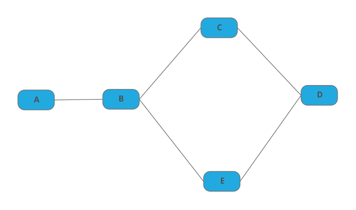

# Projet Réseaux TCP/IP
L'objectif de ce projet est de mettre en place un système de routeurs communiquant par sockets en Java.

### Gestion des sockets
Ce projet va utiliser une librairie de communication par sockets que j'ai créée et utilisée dans d'autres projets comme une application de discussion en Développement Web.\
[Lien du github](https://github.com/TorKhanNetwork/Networking/tree/python/java) 
<br>Pour résumer les fonctionnalités de cette librairie, elle permet :
- Une instanciation simple d'un serveur et d'un client
- Un protocole de connexion échangeant une clé symétrique AES grâce à des clés asymétriques
- Une communication chiffrée entre le client et le serveur
- Une compatibilité de communication entre Java, Python et Golang

Cette librairie fonctionne avec des événements, et propose au développeur un moyen d'intercepter ces événements. Ce système permet de simplifier la programmation d'une infrastructure client-serveur sécurisée.\
Voici un exemple d'implémentation :
```java
Server server = new Server("Serveur de Test", 4444);
server.startSocketListener();
```
<center>Coté serveur</center>

```java
Client client = new Client("Client de Test");
SocketWorker worker = client.addSocketWorker("localhost", 4444);
worker.startWorker();
```
<center>Coté client</center>
Les deux parties vont se connecter et établir un moyen de communication sécurisé automatiquement.

Pour pouvoir lancer ce projet, il faut ajouter tous les fichiers JAR dans le dossier libs dans le classpath. Exemple :
```
java -Dfile.encoding=UTF-8 libs/client.jar;libs/server.jar;libs/bcprov-jdk18on-173.jar;libs/bcpkix-jdk15on-1.70.jar net.affell.reseaux.tp1.Routeur A 5000
```

### Fonctionnalités d'un routeur

#### Structure
La classe Routeur se lance avec deux arguments, le nom du routeur ainsi que le port d'écoute.\
Chaque routeur va écouter les connexions sur un port spécifié et en même temps écouter l'entrée de l'utilisateur dans la console.

#### Commandes
- help : Affiche la liste de toutes les commandes
- list : Liste les connexions établies entrantes et sortantes
- ping <routeur> : Envoie une requête ping sur le routeur précisé
- connect <ip> <port> : Établit une connexion sur le routeur cible précisé
- send <routeur> <message> : Envoie un message au routeur spécifié par son identifiant
- traceroute <routeur> : Affiche la route pour communiquer avec le routeur précisé
- showroutes : Affiche la table de routage dynamique

#### Routage dynamique
Le routeur garde automatiquement en mémoire ses voisins directs, qui sont connectés grâce à l'utilisation de la commande `connect` sur un des deux routeurs. Cette mémoire représente sa table de routage statique et est implémentée sous la forme d'une `HashMap`.\
Avec ces informations, le routeur ne peut communiquer seulement qu'avec ses voisins directs. Cependant, l'utilisateur peut communiquer avec les autres routeurs sur le réseau si il existe au moins un chemin allant jusqu'à ce routeur dans le graphe non orienté du réseau de routeurs mis en place.\
Pour ce faire, le routeur possède une table de routage indirecte, qui va attribuer à un routeur dans le réseau un voisin direct optimal à contacter.\
Cette table de routage indirecte n'est pas remplie à la connexion, mais lors des requêtes entre routeurs.\
Par exemple, on considère ce réseau :

Si le routeur A veut envoyer un ping au routeur D :
1. Il n'a pas d'entrée indirecte pour D, donc il va parcourir le réseau en largeur en envoyant la requête à tous ses voisins (B).
2. B reçoit la requête de A, il remarque qu'elle ne lui est pas destinée, donc il va regarder si D est un voisin direct ou si il possède une entrée dans sa table indirecte pour D.
3. B n'a pas d'entrée indirecte pour D, donc il va parcourir le réseau en largeur en envoyant la requête à tous ses voisins (C et E).
4. Idem que le 2. pour C et E, sauf que cette fois ci les deux routeurs remarquent que dans le chemin de la requête de A, cette requête les a atteints avec l'intermédiaire de B. Ils en déduisent donc que A est atteignable de façon optimale en communiquant avec B.
5. C et E envoient la même requête en double à D. D va traiter la requête la plus rapide et en déduire que A et B sont atteignables de façon optimale en communiquant avec C ou E suivant la rapidité des routeurs.
6. D remarque que les requêtes lui sont destinés, il y répond donc en double mais en passant par le routeur qu'il a déterminé optimal pour atteindre A.
7. Le chemin inverse se produit pour la réponse au ping, sauf que cette fois ci C et E savent qu'il faut passer par B pour atteindre A.
8. Lors de cette requête réponse, les routeurs B et A vont aussi déterminer le routeur optimal pour communiquer avec D, C et E.
